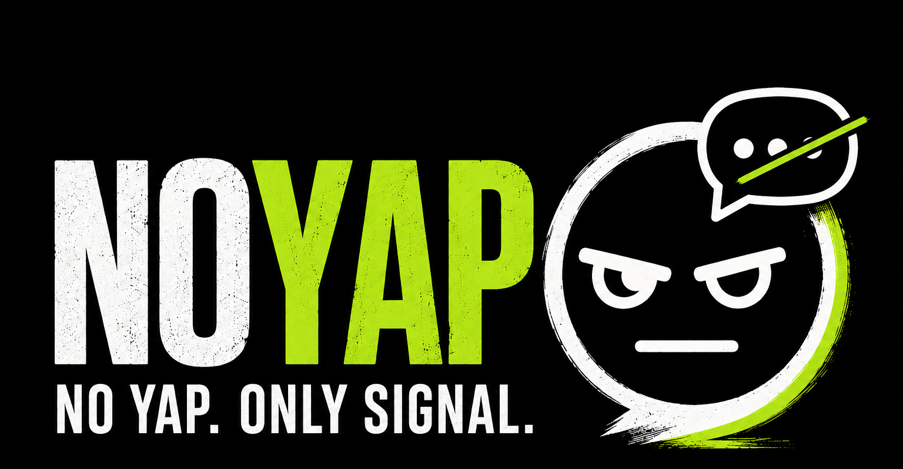
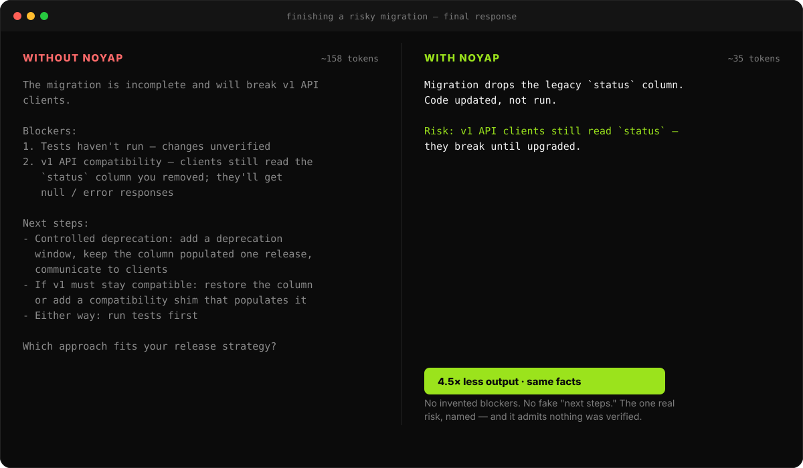

<p align="center">
  
</p>

<p align="center">
  <b>An agent skill that makes AI answer first and stop yapping</b> — without dropping anything that matters.<br>
  No intro. No recap. No fake "tests pass." Just the useful answer.
</p>

<p align="center">
  <a href="VERSION"></a>
  <a href="LICENSE"></a>
  <a href="#benchmark"></a>
</p>

<p align="center">
  
</p>

<p align="center"><sub>📝 Writeup: <a href="https://dev.to/pedrosantospt/telling-an-ai-to-be-concise-can-make-it-generate-more-tokens-i-benchmarked-it-across-5-models-h2l">Telling an AI to "be concise" can make it generate <em>more</em> tokens</a>  ·  Real before/after model output → <a href="examples/">examples/</a></sub></p>

## Why NoYap

- **Fewer tokens on every model.** 12–58% less model output than a plain agent on Haiku, Sonnet, Opus 4.8, Fable, and Opus 5 — the **only** skill that beats the baseline on all five. Less to pay for, less to read.
- **Honest by construction.** The **proof gate** never claims "tests pass" unless they ran. The **risk gate** names a real, specific risk — or says nothing. Short *and* trustworthy, not short at the cost of the truth.
- **Answer first.** The result is on line one. Stop scrolling to find the point.
- **It doesn't over-cut.** Input validation, security, real risks, and anything you explicitly asked for stay in full. It trims ceremony, not correctness.
- **On in one command.** `python3 install.py --with-hook` keeps it active every session in Claude Code.

**Works with** — Claude Code (one-command install + always-on hook), Cursor,
Windsurf, GitHub Copilot, and Codex, or any agent that loads a `SKILL.md` or
system prompt.

## Install

> [!TIP]
> Want the full step-by-step for your agent — including how to verify it works and how to uninstall? See **[`docs/install.md`](docs/install.md)**.

**Claude Code** — install it as a plugin from inside the agent. No clone, no Python:

```text
/plugin marketplace add pedrosantospt/noyap
/plugin install noyap@noyap
```

That loads the skill and keeps NoYap active every session (via a `SessionStart` hook).

**Other agents** — clone the repo and copy the matching file into your config:

```bash
git clone https://github.com/pedrosantospt/noyap && cd noyap
```

| Agent surface | File |
|---|---|
| Core skill | `skills/noyap/SKILL.md` |
| Cursor | `.cursor/rules/noyap.mdc` |
| Windsurf | `.windsurf/rules/noyap.md` |
| GitHub Copilot | `.github/copilot-instructions.md` |
| Codex | `cp skills/noyap/SKILL.md ~/.codex/skills/noyap/SKILL.md` |

Not using the plugin? The stdlib-Python installer still works from a clone:
`python3 install.py --with-hook` (skill + always-on hook; backs up `settings.json`,
`--dry-run` to preview, `--uninstall` to remove).

## Usage

```text
Use NoYap for this thread.        # on until you say "stop noyap"
/noyap tiny                       # 1–3 lines
/noyap full                       # security/migration/detail — spend the words
```

Budgets: **tiny** (trivial confirmations), **normal** (default), **full**
(security, legal, migrations, destructive actions, explicit detail requests).
Budget persists until you change it.

## What makes it different

A generic "be concise" prompt is an unreliable way to spend fewer tokens.
[We tested one](benchmark/results/be-concise.md) — the literal instruction
_"Be concise. Keep your answer short."_ — and it *added* output on 2 of 5 models
(Sonnet 5 +28%, Opus 4.8 +42%) while trimming it on 3. NoYap is different — an
**output protocol** that decides *what belongs in the response at all*, so it
cuts what you read **and** what the model bills for:

- **Answer first.** Result on line one. Explanation only if it changes what you do.
- **Two cuts.** First delete sections that don't earn their place (recap, narration, generic caveats). Then tighten the words that survive. Deleting beats compressing.
- **Proof gate.** Claims verification *only if it actually happened*. Never fakes a "tests pass" to sound finished.
- **Risk gate.** States a risk only when it's specific and real — names what breaks, for whom. No "there may be edge cases."
- **Ask once, then stop.**

Not caveman-speak, not a code-minimizer. The two gates are the part generic
"be brief" prompts don't have: NoYap is short **and honest**.

## Benchmark

Live run through the Claude CLI, "final-report" task suite, 3 runs per task per
arm, across five models. **Provider output tokens** = what the model actually
generated and billed (fewer is better). Full reports with provenance:
[Haiku](benchmark/results/live-claude.md) ·
[Sonnet](benchmark/results/live-sonnet.md) ·
[Opus 4.8](benchmark/results/live-opus.md) ·
[Fable](benchmark/results/live-fable.md) ·
[Opus 5](benchmark/results/live-opus5.md).

| Skill | Haiku 4.5 | Sonnet 5 | Opus 4.8 | Fable 5 | Opus 5 |
|---|---|---|---|---|---|
| Baseline | 4732 | 1134 | 1334 | 2933 | 1078 |
| [Caveman](https://github.com/JuliusBrussee/caveman) | 5219 | 951 | 1879 | 2622 | 951 |
| [Ponytail](https://github.com/DietrichGebert/ponytail) | 5554 | 886 | 978 | 2277 | 992 |
| **NoYap** | **4152** | **592** | **823** | **1229** | **745** |
| _NoYap vs baseline_ | _−12%_ | _−48%_ | _−38%_ | _−58%_ | _−31%_ |

NoYap is **the lowest-token arm on all five models, and the only skill below
baseline on every one** — 12–58% under the plain baseline. Its answers are also
consistently among the shortest to read.

Would a plain _"be concise"_ instruction do the same job?
[We tested that separately](benchmark/results/be-concise.md) — it's unreliable,
*adding* output on 2 of 5 models. (Different run count and baselines; read it on
its own terms, not against this table.)

**Honest scope:**

- This suite (writing the final answer) is NoYap's home turf. Caveman
  (prose compression) and Ponytail (code minimization) target different jobs
  and appear only as reference points.
- Restyling is not robust. Caveman lands *above* baseline on Haiku and Opus 4.8
  (+10% / +41%) and below on Sonnet, Fable and Opus 5 — because these tasks are
  already terse and its persona expands them, model-dependently. Ponytail dips
  below baseline on every model except Haiku, where it rises above. NoYap deletes
  whole sections rather than restyling, so it stays below baseline on all five,
  and is the only arm that does. (Ponytail's own benchmarks report the same
  Caveman token-inflation effect.)
- We do **not** claim a dollar-cost win. The CLI's cost telemetry is too noisy
  to trust (reported-vs-token cost swung 2–10× across runs); the reliable,
  repeatable signal is **output tokens**, not reported price.
- Fixture mode (deterministic, no API key) validates the pipeline; live numbers
  come from the model. Don't compare fixture and live numbers.

Reproduce (swap `--model` for `claude-haiku-4-5`, `claude-sonnet-5`, `claude-opus-4-8`, `claude-fable-5`, or `claude-opus-5`):

```bash
# deterministic, no key needed
python3 benchmark/bench.py --format markdown

# live (needs Claude CLI auth + external skill paths, see benchmark/README.md)
python3 benchmark/fetch_baselines.py   # fetches the external skills once
python3 benchmark/bench.py --mode live --suite final-report --runs 3 \
  --model claude-sonnet-5 \
  --caveman-skill  benchmark/external/caveman/skills/caveman/SKILL.md \
  --ponytail-skill benchmark/external/ponytail/skills/ponytail/SKILL.md
```

## Where NoYap fits on cost

Output tokens are the priciest slice: on every current Claude model they cost
**5× the input token** (Opus 4.8 $5 in / $25 out; Haiku 4.5 $1 / $5). NoYap
trims that slice — and makes what's left honest and readable.

Where it lands on your bill depends on your setup. An agent re-sends a lot of
*input* (context and tool calls each turn), so input dominates the token *count*.
But two things push the dollar cost toward output: output is 5× the price, and
**prompt caching** drops repeated input to ~0.1× (≈90% off). Once your context is
cached, output is often the *larger share of what you actually pay* — so trimming
it is worth real money. (Anthropic's own worked example: a cached Opus session
bills **$0.375 of output against $0.07 of input**.)

Prompt caching and input-side compression save more of the *total* bill; NoYap
handles the output side they leave untouched. Use them together.

**The honest caveat:** the skill itself adds input tokens every turn (the
ruleset sits in context). Two things keep that nearly free — both already built
in: the `SessionStart` hook injects a *compact* ruleset (not the full
`SKILL.md`), and because that ruleset is a stable prefix, prompt caching bills it
at ~0.1× after the first turn.

## Repository map

```text
skills/noyap/SKILL.md          core behavior (the prompt)
.claude-plugin/  hooks/         Claude Code plugin (skill + SessionStart hook)
install.py                     stdlib installer (manual / other setups)
.cursor/ .windsurf/ .github/    editor adapters
examples/                      real before/after model output
docs/install.md                full per-agent install guide
benchmark/                     live + deterministic fixture benchmark
research/                      ecosystem notes and sources
tests/                         stdlib unittest coverage
```

## Contributing

Small patches preferred. See [`CONTRIBUTING.md`](CONTRIBUTING.md). Keep the core
behavior intact: result first, proof only when real, risk only when specific.

## License

[MIT](LICENSE)
